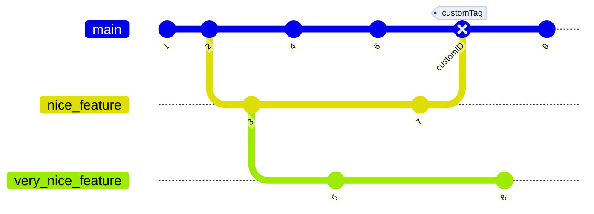

# Version control with Git - Part 1 
by **Martin Hronec**

## What is a *version control*

* *version control* is a method for tracking changes to source code
* from Wikipedia: "the management of changes to documents, computer programs, large web sites, and other collections of information."
* it enables effective collaboration
    * who wrote this part of code?
    * when was this part of code last edited?
    * why/when did it all stop working?
    
* where do we see version control? 

## What is *Git*?

* in XKCD words:

* we will try to do it differently!
    * *understanding*" instead of just *memorizing*
* we will approach Git  bottom-up, i.e. starting with it's data model
    * learning Git top-down (starting with its interface / command-line interface) can lead to a lot of confusion

-------------------------------------

### Git

* a revision control system, a program to manage your source code history
* standard for version control
* can be used for:
    * small projects with one developer
    * huge projects with thousands of contributors
            * e.g. working remotely by hosting a code on public servers like GitHub, GitLab, etc.
* a free open source system
* available on Unix based platforms, Windows and macOS
* has a distributed architecture
    * each person contributing to a repository has full copy of the repository

* **majority of state-of-the-art software projects are under Git!**

    * explore directly on GitHub [here](https://github.com/trending?since=monthly)
        * [stable-diffusion](https://github.com/CompVis/stable-diffusion)
        * Python's [pandas](https://github.com/pandas-dev/pandas)
        * [tensorflow](https://github.com/tensorflow/tensorflow)
        * editor [Visual Studio Code](https://github.com/microsoft/vscode)
        * [kubernetes](https://github.com/kubernetes/kubernetes)
        * and much more!

* note: what is GitHub?
    * provides hosting for software development and version control using Git
    * from an youtube comment on one of the Git tutorials:
        >Git is related to Github the same way porn is related to Pornhub.

* created in 2005 by Linus Torvalds to help manage the task of developing the Linux kernel ([a cool Git origin story](https://www.linuxjournal.com/content/git-origin-story))

## Git installation & setup
* follow [instructions](git_installation.md)

## Command line interface

* **a shell** is a user interface for access to an operating system's services
    * it is named a shell because it is the outermost layer around the operating system
    
* shells use 
    * command-line interface (CLI)
        * commands (and syntax) knowledge necessery
        * shell-specific scripting language (like bash)
        * bash is a popular default shell on Linux and macOS
            * bash is an acronym for *Bourne Again Shell*
    * graphical user interface (GUI)
        * easy-to-use with certain disadvantages

* at its core, Git is a set of command line utility programs that are designed to execute on a Unix style command-line environment
* operating systems like Linux and macOX both include built-in Unix command line terminals
* Git bash is an application for Microsoft Windows environments which provides an emulation layer for a Git command line experience
* Git Bash is a package that installs Bash, some common bash utilities and Git on a Windows machine
    * it has the same operations as a standard Bash experience
* Git bash comes included as part of the Git for Windows package

### Bash basics

* `echo` returns whatever you type at the shell prompt

* `pwd` prints the current working directory
    * the current working directory is the default place where the shell commands will look for data files 
* the UNIX file hierarchy has a tree structure
    * to reach a particular folder or file, we need to traverse certain paths within this tree structure
    * paths separate every node of the above structure with the help of a slash character - `/`
* `ls <directory>` to list contents of a directory
    * `ls <directory> -a` to list all hidden files
    
* `cd <directory>` changes the active directory to the path specified
    * `cd ..` changes to the parent directory
    * `cd` changes to the HOME directory

* `mkdir` creates a folder
* `touch` creates an empty file
* `rm` delete a file
    * `rm -r *` deletes a folder with all its contents

* the redirection operator `>` will redirect the normal output initially intended to be  on stdout and print it directly into the file.

    * `echo "Git is awesome." > file.txt` 
* `cat` reads a file and outputs its content

## IDEs
* integrated development environment
* use some!
* standard features:
    * text editor
    * *code completion*
    * linting
    * debugger
* lot of options, but the best (IMHO) is hands down [Visual Studio Code](https://code.visualstudio.com)
    

## Git's data model

* version control is a method for tracking changes to source code
* modelling history of a collection of files and folders within some top-level directory through relating snapshots
* to be a Git repository, we need objects and system for naming those objects
    * refs is the system for naming those objects
    
* a history is a [directed acyclic graph (DAG)]() of snapshots
    * each snapshot refers to a set of "parents (previous snapshots)
        * why set of "parent" snapshots instead of just one "parent" snapshot?
* in Git's terms:        
    * these snapshots are called **commits**
    * a file is called a **blob** (a bunch of bytes)
    * a directory is called a **tree**
        * maps names to blobs or trees (directories can contain other directories)
        
        
* a "snapshot" is basically the top-level tree in your project

* ASCII art for pedagogical purposes:

`root_folder (tree)
|
+- folder (tree)
|  |
|  + file.txt (blob, contents = "A barber learns to shave by shaving fools.")
|
+- another_file.txt (blob, contents = "I don't give a git.")`

### Objects and content-addressing

* an "object" is a blob, tree, commit
* in Git data store, all objects are content-addressed by their **SHA-1 hash**
    * moving to SHA-256, see [collision](https://git-scm.com/docs/hash-function-transition/)

### References

* all snapshots can be identified by their SHA-1 hash
    * inconvevient - try to remember strings of 40 hexadecimal characters
    * Git's solution: readeble names for SHA-1 hashes - **references**
    
* references are pointers to commits
* objects are immutable (building blocks)
* references are mutable (can be updated to point to a new commit)
    * e.g. `master` reference - typically pointing to the the main "codebase"
    
* we want a notion of "where we currently are" (e.g. in the history of the project)
    * when we take a new snapshot, we know what it is related to
    * "where we are/what are we looking at" is a special reference called **HEAD**

## Git repository

* a Git **repository** is the data objects and references
* all Git stores are objects and references
    * easy
    
* all git commands map to some manipulation of the DAG which captures the relation between snapshots (history and development) 
    * e.g. by adding objects and adding/updating references
    
* wherenever you're typing in any command, think about what manipulation the command is making to the underlying graph data structure
* similarly, if you're trying to make a particular kind of change to the DAG, there is probably a command corresponding to it

### Initializing repositories

* 2 main options to create a Git repository:
    * `git init` 
    * `git clone https://github.com/martinhronec/version_control_IES.git`
        * we will talk about this option around Git remotes

* `git init` creates a new subdirectory named *.git* that contains all information for version control
    * converts an existing (unversioned) project
    * initiates a new empty repository
    * we will look inside later when we are more familiar with working concepts 

### Lifecycle of a file/blob

* each file in the working directory can be in one of two states: 
    * tracked
        * files that were in the last snapshot - can be *modified, unmodified or untracked*
    * untracked
        * any files that weren't in the last snapshot are are not in the staging area (explained later)
* a created file will not be automatically untracked until you add it
    * when you clone a repository (instead of `git init`-ing it, all of your files will be tracked and unmodified 
       

### Status of the files/repository

* `git status` shows which files are in which state

* create a new file, e.g. hello_world.txt
    * hello_world.txt is *untracked*
    * Git won't start tracking it until we explicitly tell it to
* to start tracking the hello_world.txt file, use `git add hello_world.txt`
    * run `git status` again to see that file is staged now
* to see what is staged (what will commited/snapshotted next,`git diff --cached` or `git diff --staged` 
    * `git diff` shows you the exact lines added and removed
        * can be used between different objects, e.g. branches as we will see later on
* `git diff` by itself doesn’t show all changes made since your last commit—only changes that are still unstaged. 

### Main sections of a Git project

### Commiting the changes

* `git commit` as equivalent of "saving"
    * only staged things go to the commit
* typing only `git commit` will launch a selected (in config) file editor
    * write `git commit <file-to-commit> -m "Commit message"` if you want to skip the detailed message
* the commit shows some self-info
    * which branch you committed to (master)
        * branch is an "independent" line of development - more later
    * what SHA-1 checksum it has
    * how many files were changed (and statistics about lines added and removed in the commit)
    
* only staged files are commited
    * anything not staged is just chilling there modified

* every commit (you make), is a snapshot of your project
    * you can revert to it later
    
* if you want to skip the staging area, just use `git commit -a -m "<commit-message>"
* compare what happened to the actions shown on the previous picture "File Status Lifecycle."

### The commit history

* `git log` 
    * with no arguments, `git log` lists the commits made in that repository in reverse chronological order. 
    * it lists each commit with its SHA-1 checksum, the author's name and e-mail, the date written, and the commit message
* plenty of arguments with `git log`
    * `git log -p -2` shows the diff introduced in each commit, `-2` limits the output to only th e last two entries
    * `git log --stat` shows some abbreviated stats for each commit, e.g. list of modified files, how many files were changed and how many lines in those files were added and removed
    * `git log --pretty=oneline`, 
    * `git log --graph`       
* in practice, developers typically use some nice graphing extension/utility, e.g. 

### Three trees of Git

* we've just seen the basic (committing) part of the Git workflow
* try understand the Git's internal state management system first, everything should be easier later

* **the working directory** is in sync with the local filesystem
    * it represents the immediate changes made to content in files and directories
    * can be seen using `git status` (or just by looking at the files and folders the way you are used to)
* the **staging index** is tracking working directory changes, that have been promoted with `git add` (to be stored in the next commit)
    * a complex internal caching mechanism hidden from the user
* to accurately see the state of the staging index, use `git ls-files` 
    * a debugging tool for inspecting the state of the staging index tree
    * `-s` stands for the `--stage` option
    
* **the commmit history**     
    
* SHA-1 hash of the staging index is different than the one in the Commit History
* the git status shows differences between the commit history and the staging index. 
    * after adding file (including to the staging area, its hash changes 
    

## Example of Git's data model

* after the first commit:
    * Git checksums each subdirectory (only the root project directory in this case)
    * stores objects (one file in our case) in the Git repository
    * then it creates a commit object that has the metadata and a pointer to the root project tree so it can re-create that snapshot when needed
    
* repository now contains 3 objects:
    * one blob for the content of your file, 
    * one tree that lists the contents of the directory and specifies which file names are stored as which blobs 
    * one commit with the pointer to that root tree and all the commit metadata

* we will use [git-graph](https://github.com/hoduche/git-graph) to quickly show the underlying data model of our repository
    * see the github page for the color reference
* e.g.

* note that this graph does not correspond to the above one (different hashes)

### 2-commits repository representation

* if you make some changes and commit againt, the next commit stores a pointer to the commit that came immediately before it
  

### 3-commits repository representation

## Git - plumbing and porcelain
    
* originally Git was a toolkit for rather than a "user-friendly" VCS
    * => it has a number of "low-level" subcommands 
* low-level commands are generally called "plumbing' commands
* more "user-friendly" commands are called "porcelain" commands

* many of these commands aren't meant to be used manually on the command line
    * rather used as building blocks for new tools and custom scripts
    
* when you create a new Git repository, Git creates a .git directory
    * this is where almost everything that Git stores and manipulates resides
    * to back up or clone your repository, copy this single directory
    
* now we will talk about what you can see in a repository

### Git objects 

* Git is a content-addressable filesystem
    * Git is a simple key-value data store 

* contents of the .git folder:
    * *config* file contains your project-specific configuration options
    * *info* directory keeps a global exclude file for ignored patterns that you don't want to track in a .gitignore file
    * *hooks* directory contains your client-side or server-side hook scripts
    * **HEAD** points to the branch you currently have checked out
    * **objects** directory stores all the content for your database
    * **refs** directory stores pointers into commit objects 
    * **index** file is where Git stores your staging area
    
### Hashing

* `git hash-object` takes some data and stores it in your .git/objects directory (the object database) and gives you back the unique key that now refers to that data object
* with `git init`, Git initializes the objects directory and creates a pack and info subdirectories in it, but there are no regular files
* the output from the above command is a 40-character checksum hash
    * this is a SHA-1 hash - a checksum of the content you're storing plus a header
* in your objects directory, you can see that it now contains a file for that new content
    * Git stores data as a single file per piece of content

* once you have content in your object database, you can examine that content with the `git cat-file`
    * a Swiss army knife command for inspecting Git objects 
    * `-p` : first figure out the type of content, then display it appropriately 
    * `-t` : tells you the object type of any object in Git given its SHA-1 key
* writing into file, saving it, hashing it and then saving new content and hashing it leads to object database having both versions of this new file
* we can delete local copy of the created file 
    * and use Git to retrieve it from the objects database
* remembering the SHA-1 key for each version of your file isn't practical
    * plus you are not storing the filename in your system, just the content
    * this object type is called a *blob*

### Removing files

* not a "plumbing command"
* to remove a file from Git, remove it from your tracked files 
    * more accurately: remove it from the staging area and commit
    * `git rm <file>` stages the file's removal
    * next time you commit, the file will be gone and no longer tracked

* another usecase:
    * keep the file in the working tree, but remove it from the staging area (i.e. making it untracked)
    * `git rm --cached <file>`

* there is no option to remove a file from only the working directory

* use `git rm -n` for a "dry run" - shows files will be removed

* files, directories, and file-glob patterns can be passed to the `git rm` command 
    * to remove a directory, use `git rm -r` which stands  for "recursive"

* `git rm` does not remove branches (more when talking about branches)

* why not simply deleting the file/folder on the file-system level?
    * you can and then stage the change and commit
    * `git rm` is convenience

### Moving files

* Git doesn't explicitly track file movement
    * if you rename a file in Git no metadata is stored in Git that tells it you renamed the file

* to rename a file you can run
    * `git mv <file_from> <file_to>`
         * you will see in `git status` that Git considers it a renamed file
    * it is equivalent to running something like this:
        * `mv <file_from> <file_to>`
          `git rm <file_from>`
          `git add <file_to>`

### Ignoring files - `.gitignore`

* when I have shown you git-graphs, you might have noticed the untracked files in my repository
    * these were precisely the produced graphs we might wish to ignore
* a class of files we do not want to add but also do not want it being shown as untracked
    * e.g. data, log files, files from the build

* set up a `.gitignore` file before you start your commiting spree

* some rules:
    * blank lines or lines starting with # are ignored
    * standard glob patterns work
    * you can end patterns with a forward slash (/) to specify a directory
    * you can negate a pattern by starting it with an exclamation point (!)
    
* *glob patterns* are like simplified regular  expressions that shells use
    * An asterisk (*) matches zero or more characters
    * [abc] matches any character inside the brackets (i.e. a, b, or c)
    * A question mark matches a single character
    * [0-9] matches any character betweent the start and the end
   
* there are templates of `.gitignore` files available for most of the languages and types of the projects, see option on GitHub when creating a repository

## Undoing changes

* `git log` to show history 
    * `git log --graph`
    
* let's discuss the available 'undo' Git strategies and commands
    * `git reset`
    * `git revert`
    * `git checkout`
    * and more
    
* Git does not have a traditional 'undo ' system
* **careful, you can't always undo some of the undos!**

## Checkout

* we've looked at the history and we've taken the file and modified it
    * we can use the history besides reading the messages

* `git checkout`
    * allows you to do many things 
    * one thing it allows you to do is to move in your version history

* give `git checkout <commit id>` (you can provide just the first couple of characters)
    * it will change the state of the current working directory to how it was at that commit 

* `git checkout <commit hash>` shows the state of the repository at that specific commit
* to go back to the "main" line of development: `git checkout main`

### Undoing a commit using `git checkout`

* the idea behind any VCS: store "safe" copies of a project
* to see the snapshot of repository in some previous time, use that snapshot's/commit's reference to visit it 
    * `git checkout <commit_id>` 
* ! when you checkout a previous commit, HEAD no longer points to a branch - it points directly to a commit
    * this is called a **detached HEAD** state
        * checking out a previous commit leads to HEAD no longer pointing to *master*
     
* in a detached state, any new commits you make will be orphaned, when you move HEAD back to the master
* orphaned commits are up for deletion by Git's garbage collector
    * garbage collector runs on a configured interval and permanently destroys orphaned commits
* from the detached HEAD state, you can create a new branch using `git checkout -b <master/branch_name>`
    * more on this later
    * ! unfortunately, if you need the previous state of master, this strategy is not a very good idea
 
* checking out an old file does not lead to movement of the HEAD pointer (avoiding detached HEAD state)

## Reverting and reseting

### `git revert`

* used for undoing changes to a repository's commit history
* instead of removing the commit from the history, it figures out how to invert the changes introduced by the commit and appends a new commit with the resulting inverse content
    * prevents Git from losing history
* other 'undo' commands (e.g. `git checkout` and `git reset`) move the HEAD and branch ref pointers to a specified commit
* Git revert also takes a specified commit, then:
    * inverses the changes from that commit,
    * creates a new "revert commit"
    * the ref pointers are updated to point at the new revert commit
    

### `git reset`

* a complex and versatile tool for undoing changes
* 3 primary forms of invocation
    * `--soft`
    * `--mixed`
    * `--hard`
* these 3 forms correspond to the Git's internal state management mechanisms
    * HEAD
    * the staging index
    * the working directory
    
* at the surface level, the behaviour of `git reset` is similar to `git checkout`
    * `git checkout` operates solely on the HEAD ref pointer
    * `git reset` will move the HEAD ref pointer and the current brnach ref pointer

* [git checkout vs. git reset](https://www.atlassian.com/git/tutorials/undoing-changes/git-reset)

* the pointer to the commit history is always modified, arguments `--soft`, `--mixed` and `--hard` correspond to the ways we modify the staging index and working directory trees

### `git reset --hard`

* the most direct and DANGEROUS option 
* the commit history ref pointers are updated to the specified commit
* **the staging index and the working directory are reset to match that of the specified commit**
    * any previously pending changes to the staging index and the working directory gets reset to match teh state of the commit tree
    * any pending work not commited will be lost
    * `git reset HEAD~2 --hard` to effectively remove the last two commits from the project history 
    * **NEVER PERFORM THE ABOVE OPERATION ON ALREADY PUBLISHED COMMITS (TO A SHARED REPOSITORY)**
* this data loss cannot be undone!
    * if you look at the objects database, removed commits will still be there, but only until next garbage collection by Git! 

### `git reset --mixed`
* the default opption
    * it is the same as executing `git reset`
* the ref pointers are updated
* the staging index is reset to the state of the specified commit
* any changes that have been undone from the staging index are moved to the working directory
* compare this to the --hard reset case where we've lost these updates 
* `git reset HEAD <file>` is used for unstaging a file sometimes, but safer to follow the Git recommendation `git restore --staged <staged file>` to remove from the stagine area

### `git reset --soft`

* the ref pointers are updated and the reset stops there
    * the staging index and the working directory are left untouched

* this behaviour can be hard to clearly demonstrate

* if you execute soft reset with the default argument of the target commit (which is HEAD), by default nothing will change since the commit history was already sitting on HEAD
    * we need to provide it with some historical commit id
    
* possible usecases:
    * useful if you committed to the wrong branch. all changes go back to staging area and move with you while you checkout the right branch
    * the easiest way to squash that many commits would be to do `git reset --soft` and then commit

### Don't reset public history
* don't use `git reset` when any snapshots have been pushed to a public repository 
    * you have to assume that other developers are reliant upon it

## Branches

* branching means:
    * diverging from the main line of development
        * and continue to do work without affecting the main (stable/production) development line
    * developing multiple things in parallel

* in other VCS tools, this requires a lot of resources
    * e.g. to create a newcopy of your source code directory   
* not in Git! - very lightweight, killer feature

* when you commit in Git, Git stores a commit object that contains a pointer to the snapshot of the content you staged:
    * the author and message metadata
    * and zero or more pointers to the commit or commits that were the direct parents of this commit:
        * zero parents for the first commit
        * one parent for a normal commit
        * and multiple parents for a commit that results from a merge of two or more branches
        
* you can view all commits across branches using `git log --branches=*`        

### Creating a new branch

* a branch in Git is simply a lightweight movable pointer to one of the commits
* the default branch name in Git is  or *main*
    * originally *master* see [story why it changed](https://www.bbc.com/news/technology-53050955)
    * as you initially make commits, you're given a main branch that points to the last commit you made
    and every time you commit, it moves forward automatically
* **what happens when you create a new branch?** 
    * it creates a new pointer for you to move around!
    
* `git branch <branch_name>` to create a new branch
* look at the following 2 graphs to see that indeed, new branch is just another pointer pointing to the last commit

* added a new branch called "brave" with `git branch brave`

* HEAD is still pointing to the master
    * if we would add another commit now, we would be contributing to the main

### HEAD

* how does Git know what branch you're currently on?
    * it keeps a special pointer called *HEAD*
        * a pointer to the local branch you're currently on
        * you can see it in the file .git/HEAD
        
* for now we are still on the "master" branch, we did not yet switched to the "new branch"

* to switch to another branch, you can use `git checkout <new_branch>`
    * `git status` will confirm that you are indeed looking at it
    * `git log` will show *HEAD* pointing to the "new branch"
* if you change a file, stage it and commit it, your project history will diverge

## Branching and merging

* you've decided that you're going to work on issue #12
    * issues are generally the way code development is organized and managed, see [github manual](https://guides.github.com/features/issues/)

* `git checkout -b iss12`

* (look at the GitGraph)

* now on the new branch
    * create some new file or make some changes
    * commit it and look at the graph again
        * your project history has diverged

(graph after working on new branch)

* a branch in Git is actually a simple file that contains the 40 character SHA-1 checksum of the commit it points to
    * => branches are cheap to create and destroy
    * creating a new branch is as quick and simple as writing 41 bytes to a file (40 characters and a newline).

* now imagine you need to make a *hotfix*, to do this, you need to move away from the iss53 back to the main line of the development
* to switch from the current branch to another, you need to commit your changes
    * or stash them, which we will be talking about later
    
* you switch back to *master*
    * you create a new branch named "hotfix"
    * you hotfix what you need
    * then you need to merge it back to the master (after some tests)

(look at GitGraph after hotfixing)

## Merging - fastforward
* branching is usefull only if we can combine things back in the end
* `git merge <branch_to_be_merged_into_where_HEAD_is_pointing>`
* because the commit pointed to by the branch you merged in was directly upstream of the commit you’re on, Git moves the pointer forward
    * when you try to merge one commit with a commit that can be reached by following the first commit’s history, Git simplifies things by moving the pointer forward because there is no divergent work to merge together—this is called a **fast-forward.**
    * notice that Git itself tells us this was a fast-forwart type of the merge
    * Git does the best job to automatically merge things, if not possible you need to do it manually or use `git mergetool`

(GitGraph after merging the hotfix)

* `git branch -d hotfix`

### Merging - recursive (three-way merge)

* your development history has diverged from some older point
* becausee the commit on the branch you’re on isn’t a direct ancestor of the branch you’re merging in, Git has to do some work
    * in this case, Git does a simple **three-way merge**, using the two snapshots pointed to by the branch tips and the common ancestor of the two.

* `git checkout master` & `git merge iss12`

*  TODO: chart (three snapshots used in a typical merge)

* instead of just moving the branch pointer forward, Git creates a new snapshot that results from this three-way merge and automatically creates a new commit that points to it 
    * this is referred to as a merge commit
        * it is special by the fact that it has more than one parent

* `git add <changed file>` 
* `git merge --continue` 
* if something goes wrong, e.g. there is a conflict, use `git merge --abort`
* look at the git log to see the branched development

## Merge conflicts - diverged paths

* if you changed the same part of the same file differently in the two branches you-re merging together, Git won't be able to merge them cleanly

* this is how you repository looks like 

### Merge conflicts -resolving

* if we run `git merge branch` when there is a conflict we will get (something like) following message

    * `CONFLICT (content): Merge conflict in index.html` 
      `Automatic merge failed; fix conflicts and then commit the result.`

* Git hasn’t automatically created a new merge commit
    * it has paused the process while you resolve the conflict.
    * `git status` to see which files are unmerged at any point after a merge conflict

* open the conflicting file
    * `<<<<<<<< HEAD:`
    
    `......one version`
    
    `=========`
    
    `...... second version`
    
    `>>>>>>>>> <conflicting branch name>`

* resolve each of the conflicted section in the conflicted file
* run `git add` on each file
    * staging the file marks it as resolved in Git

* run `git commit` to finalize the merge commit

* see the resulting graph on the next slide
* after resolving: 

### Merging jupyter notebooks

* jupyter notebooks are technically JSON documents  -> merging in the terminal is painfull (because of all the metadata)
* you can uses [JupyterLag-git](https://github.com/jupyterlab/jupyterlab-git) or good IDE like [VScode](https://code.visualstudio.com/)

### Branching management

* Another useful option to figure out what state your branches are in is to filter this list to branches that you have or have not yet merged into the branch you’re currently on.
    * `git branch --merged` & `git branch --no-merged`
    * branches on this list without the * in front of them are generally fine to delete with `git branch -d`
* if you have a branch with contents that are not merged in another branch yet, standard `git branch -d` will fail (error: The branch '<branch_name>' is not an ancestor of your current HEAD.

## GitHub 

* live features walkthrough, head to [https://github.com/](https://github.com/)

## Git remotes    

* use remotes to collaborate remotely
    * remotes are versions of your project that are hosted on the Internet or network somewhere
    
* **.git** folder represents an entire copy of the history, objects and the references and all the snapshots
* to cooperate with other people, they also have the entire copy of the project
    * your local copy is aware of other linked repositories

* `git remote` lists all remotes that Git is aware of
* `git remote -v` to show the URL
* `git remote add <shortname> <url>`
    * you can use `<shortname>`  on the command line in lieu of the whole URL
    
* e.g. `git fetch <shortname>` fetches all the information that you don't yet have in your repository
    * it only pulls the data to your local repository - it doesn't automatically merge it with any of your work or modify what you're currently working on
        * you have to merge it manually into your work
        * if you have a branch set up to track a remote branch, you can use the git pull commmand to automatically fetch and then merge a remote branch into your current branch
        
* we will talk more about pushing and pulling from the remotes when talking about branches
* `git remote show origin` to see more information about a particular remote
* `git remote rename <old_shortname> <new_shortname>`
* `git remote rm <shortname>`

* adding remote looks like this on a graph:

### The protocols

* Git can use 4 major network protocols to transfer data:
    * local
        * the "remote" repository is in another directory on the same host
        * `git clone <path_to_repository_>.git`
    * Secure Shell (SSH)
        * common transport protocol for Git
    * Hypertext Transfer Protocol Secure (HTTPs)
        * currently the most used protofocl for Git (smart HTTP version)
    * the Git protocol 

* HTTPs and SSH are protocols that you should be aware of

### The HTTP/S protocol

* "smart" HTTP is able to intelligently negiotiate data transfer (similar to SSH)
    * before "dumb" HTTP, which was read only mostly
* smart HTTP operates very similarly to the SSH or Git protocols but runs over standard HTTPS ports
* can use various HTTP authentication mechanisms
    * meaning it’s often easier on the user than something like SSH, since you can use things like username/password authentication rather than having to set up SSH keys.

* the most popular way to use Git now, since it can be set up to both serve anonymously like the git:// protocol, and can also be pushed over with authentication and encryption like the SSH protocol
    * instead of having to set up different URLs for these things, you can now use a single URL for both. 
    * If you try to push and the repository requires authentication (which it normally should), the server can prompt for a username and password.
        * The same goes for read access.
    
### The SSH protocol

* common transport protocol for Git
* SSH is the only network-based protocol that you can easily read from and write to
    * other 2 (Git and HTTP) are generally read-only

* to clone a Git repo over SSH you can use `git clone ssh://user@server:project.git`
    * or if you use `git clone user@server:project.git`, Git assumes SSH

* set it up to pair your local repos with the github following [this tutorial](https://docs.github.com/en/github/authenticating-to-github/connecting-to-github-with-ssh)

* PROS:
    * use it if you want authenticated write access to your repository over a network
    * easy to set up
        
    * secure (all data transfer is encrypted and authenticated
    * efficient (data as compact as possible)
    
* CONS:
    *  you can't serve anonymous access of your repository over it
        * people must have access to your machine over SSH to access it (even in read-only capacity)

### Working with remote branches

* references to the state of branches on your remote repositories
* they're local branches that you can't move
    * they are moved automatidcally whenever you do any network communication
* they act as bookmarks to remind you where the brances on your remote repositores were the last time you connected to them
* they have the form (remote)/(branch)

* when you clone from the remote repository, Git automatically:
    * names it origin
    * pulls down all its data 
    * creates a pointer to where its master branch is
    * names it origin/master locally
    
### Pushing

* if you want to share a branch, you need to push it up to a remote (where you have a write access)
    * local branches aren't automatically synchronized to the remotes 
    * you have to explicitly push the branches you want to share
* you can use private branches to do work you don't want to share
* `git push <remote> <branch>` 
    * this is a shortcut for:
        * Git automatically expands the branch name out to refs/heads/<branchname>:refs/heads/<branchname>
    * alternatively `git push origin <branchname>:<branchname>`
        * this can be used to name remote branch differently than the local one
    
* when you do a `git fetch`, you don't automatically have local, editable copies of remote branches
    * you have only a pointer (which you can't modify) 
* to merge remote stuff into your current working branch, you can run `git merge origin/<branchname>`
 
### Tracking branches

* to see the full list of remote references, use `git remote show origin`
* `git fetch --all` updates your remote-tracking branches
* `git branch -vv` lists local branches (with some info) and what each branch is tracking

* if there is a remote branch that you want to track, you can create a local branch and base it off the remote one with
    * `git checkout -b <local_branch_name> origin/<remote_branch_name>`

* checking out a local branch from a rermote branch automatically creates what is called a *tracking branch*
    * a local branch with a direct relationship to a remote branch
* if you're on a tracking branch and type `git push`, Git automaticallly knows which server and branch to push to
    * same holds for `git pull`
    
* when you clone a repository, it generally automatically creates a master branch that tracks origin/master
    * that's why `git push` and `git pull` work out of the box with no other arguments

* to delete a remote branch `git push <remote_name> --delete <remote_branch_name>`

### Pulling

* `git fetch` fetches all the changes on the server that you don't have yet, it will not modify your working directory at all
* `git pull` is basically `git fetch` followed immediately with `git merge`

## Branching Workflows

* merging from one branch into another multiple times over a long period is generally easy to do
* => you can have several branches that are always open and that you use for different stages of your development cycle
    * you can merge regularly from some of them into others
* e.g. only entirely stable code in the master branch 
    * paralel branch named "develop" for development and testing, which is merged into
    * branch "develop" pulls in topics from so colled topic branches (short-lived branches) 
* in reality, we are talking about pointers moving up the line of commits we're making
    * the stable branches are further down the line in your commity hisotry
    * the bleeding-edge branches are farther up the history
        * think about them as work silos, where sets of commits graduate to a more stable silo when they're fully tested

* now that we know the basics, the building blocks, let's discuss the collaboration workflows
    * read [this](https://www.atlassian.com/git/tutorials/comparing-workflows)